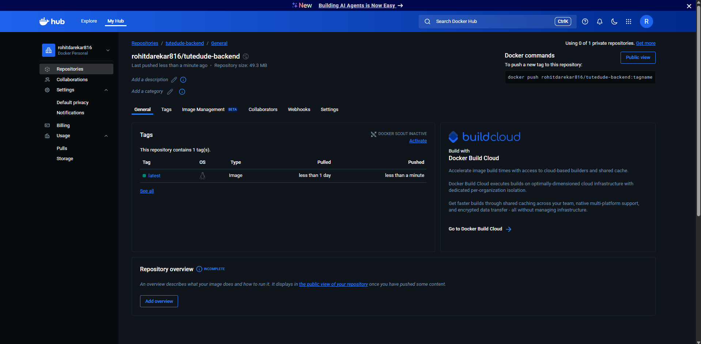
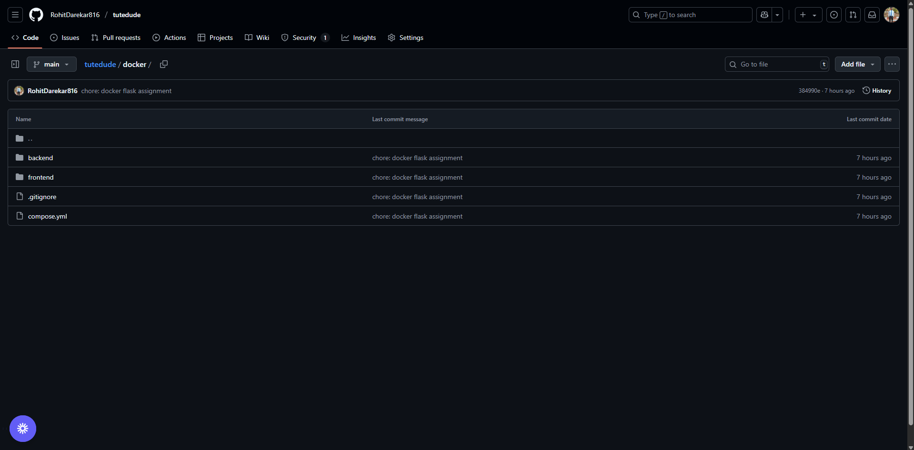

# TuteDude Docker Project

A full-stack web application built with Docker containers, featuring a Flask backend API and a Node.js frontend server.

## 📋 Project Overview

This project demonstrates a containerized web application with:
- **Backend**: Flask API with MongoDB integration
- **Frontend**: Node.js static file server
- **Database**: MongoDB for data persistence
- **Containerization**: Docker Compose for orchestration

## 🏗️ Architecture

```
┌─────────────────┐    ┌─────────────────┐    ┌─────────────────┐
│   Frontend      │    │    Backend      │    │    MongoDB      │
│   (Port 3000)   │◄──►│   (Port 5001)   │◄──►│   (External)    │
│   Node.js       │    │   Flask API     │    │   Database      │
└─────────────────┘    └─────────────────┘    └─────────────────┘
```

## 🚀 Quick Start

### Prerequisites
- Docker and Docker Compose installed
- MongoDB connection string (set in `backend/.env`)

### Running the Application

1. **Clone the repository**
   ```bash
   git clone <repository-url>
   cd docker
   ```

2. **Set up environment variables**
   Create a `.env` file in the `backend/` directory:
   ```bash
   MONGO_URI=your_mongodb_connection_string
   ```

3. **Start the application**
   ```bash
   docker compose up --build
   ```

4. **Access the application**
   - Frontend: http://localhost:3000
   - Backend API: http://localhost:5001

## 📸 Screenshots

### Docker Hub Repository


### GitHub Repository


### Application Running


## 🔧 Services

### Backend Service
- **Image**: `rohitdarekar816/tutedude-backend`
- **Port**: 5001
- **Technology**: Flask (Python)
- **Features**:
  - REST API endpoints
  - MongoDB integration
  - Data submission and retrieval
  - CORS support

**API Endpoints**:
- `GET /api` - Retrieve all data from MongoDB
- `POST /submit` - Submit name and email data
- `GET /success` - Success message endpoint

### Frontend Service
- **Image**: `rohitdarekar816/tutedude-frontend`
- **Port**: 3000
- **Technology**: Node.js with Express
- **Features**:
  - Static file serving
  - Web interface for data submission
  - Responsive design

## 📁 Project Structure

```
docker/
├── compose.yml              # Main Docker Compose configuration
├── backend/
│   ├── app.py              # Flask application
│   ├── Dockerfile          # Backend container configuration
│   ├── requirements.txt    # Python dependencies
│   ├── compose.yaml        # Backend-specific compose config
│   └── README.Docker.md    # Backend documentation
├── frontend/
│   ├── app.js             # Node.js server
│   ├── Dockerfile         # Frontend container configuration
│   ├── package.json       # Node.js dependencies
│   ├── compose.yaml       # Frontend-specific compose config
│   └── README.Docker.md   # Frontend documentation
└── README.md              # This file
```

## 🐳 Docker Configuration

### Main Compose File (`compose.yml`)
```yaml
services:
  backend:
    image: rohitdarekar816/tutedude-backend
    container_name: backend
    ports:
      - 5001:5001
    env_file:
      - ./backend/.env

  frontend:
    image: rohitdarekar816/tutedude-frontend
    container_name: frontend
    ports:
      - 3000:3000
```

## 🔄 Development Workflow

### Building Images
```bash
# Build backend image
docker build -t rohitdarekar816/tutedude-backend ./backend

# Build frontend image
docker build -t rohitdarekar816/tutedude-frontend ./frontend
```

### Pushing to Registry
```bash
# Push backend image
docker push rohitdarekar816/tutedude-backend

# Push frontend image
docker push rohitdarekar816/tutedude-frontend
```

### Running Individual Services
```bash
# Run only backend
docker compose up backend

# Run only frontend
docker compose up frontend
```

## 🛠️ Troubleshooting

### Common Issues

1. **Port conflicts**: Ensure ports 3000 and 5001 are available
2. **MongoDB connection**: Verify your MongoDB URI in `backend/.env`
3. **Container startup**: Check logs with `docker compose logs`

### Useful Commands
```bash
# View logs
docker compose logs -f

# Stop services
docker compose down

# Rebuild and restart
docker compose up --build --force-recreate

# Clean up
docker compose down -v
docker system prune -f
```

## 📚 Additional Resources

- [Docker Documentation](https://docs.docker.com/)
- [Docker Compose Guide](https://docs.docker.com/compose/)
- [Flask Documentation](https://flask.palletsprojects.com/)
- [Node.js Documentation](https://nodejs.org/docs/)

## 🤝 Contributing

1. Fork the repository
2. Create a feature branch
3. Make your changes
4. Test with Docker Compose
5. Submit a pull request

## 📄 License

This project is licensed under the MIT License.

---

**Note**: Make sure to replace `<repository-url>` with your actual repository URL and update the MongoDB connection string in the backend environment file. 